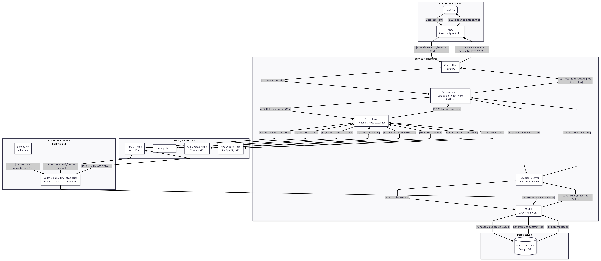
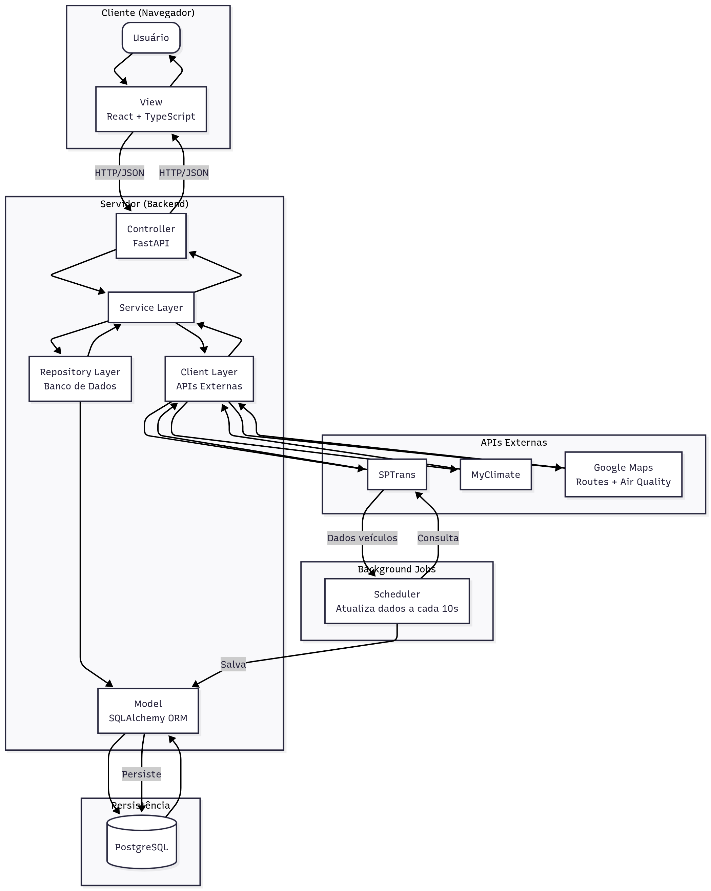
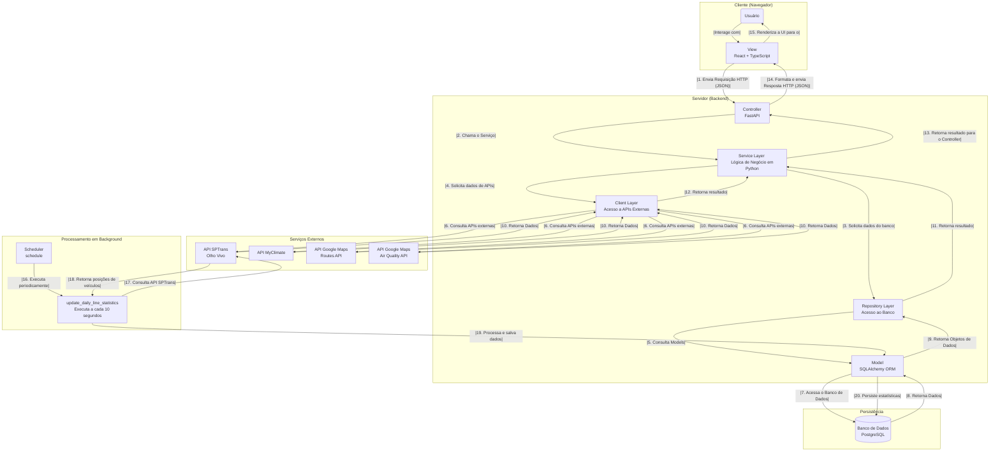
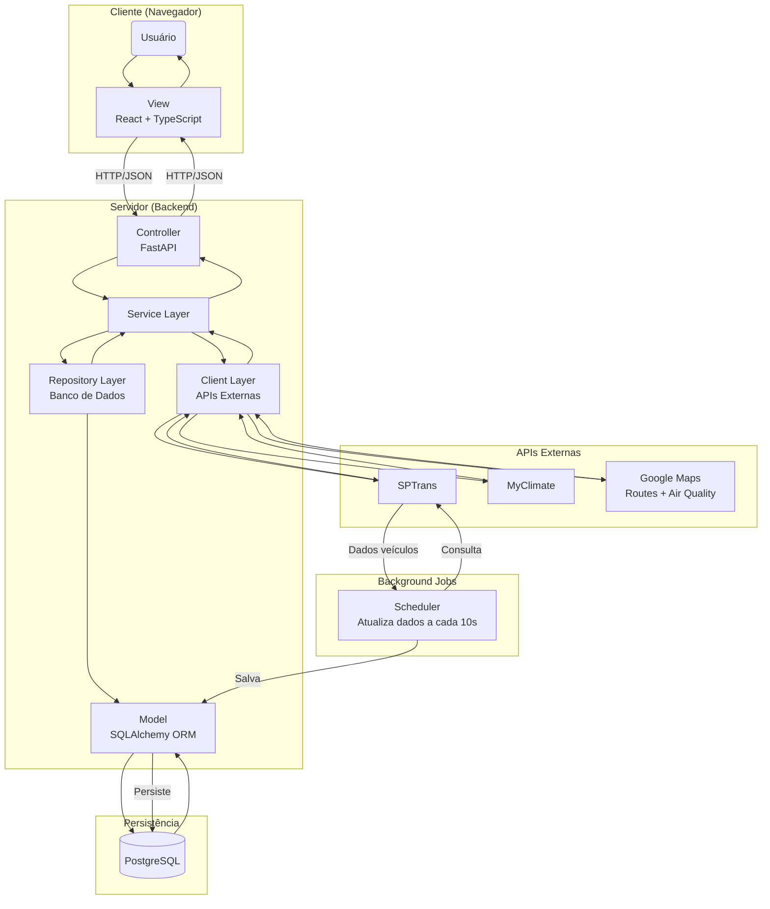

# Arquitetura

Para garantir a organização, escalabilidade e manutenibilidade do projeto BuscAr, adotamos uma arquitetura em camadas baseada no padrão Model-View-Controller-Service (MVCS). Este padrão estende o clássico MVC ao introduzir uma camada de Serviço explícita, que é responsável por conter a lógica de negócio da aplicação.

Essa abordagem promove uma clara separação de responsabilidades:

- **View (apresentação)**: focada na interface com o usuário, implementada em React com TypeScript, responsável por renderizar componentes visuais e interagir com o usuário;

- **Controller (orquestração)**: atua como um intermediário, recebendo requisições HTTP através dos endpoints FastAPI e delegando tarefas para a camada de serviços;

- **Service (lógica de negócio)**: executa as regras de negócio, cálculos e integrações, coordenando a comunicação entre repositories e models;

- **Model (dados)**: gerencia a representação de dados e a persistência no banco de dados PostgreSQL através do SQLAlchemy ORM;

- **Repository (acesso a dados persistentes)**: abstrai o acesso ao banco de dados através do SQLAlchemy ORM, encapsulando a lógica de consultas e operações CRUD;

- **Client (acesso a APIs externas)**: encapsula a comunicação com APIs externas, abstraindo os detalhes de requisições HTTP, autenticação e tratamento de erros. Embora repositories e clients sejam componentes distintos, ambos abstraem fontes de dados dos services, mantendo a lógica de acesso a dados, tratamento de erros e retry separada da lógica de negócio.

Além da arquitetura em camadas, o sistema incorpora um **scheduler** (agendador de tarefas) que executa processos em intervalos regulares. Este componente é responsável por se conectar periodicamente à API da SPTrans, coletar dados em tempo real sobre a posição dos veículos e atualizar as estatísticas diárias das linhas no banco de dados. O scheduler utiliza a biblioteca `schedule` do Python e executa a cada 10 segundos, garantindo que os dados de posicionamento e estatísticas das linhas estejam sempre atualizados.

O sistema também integra-se com múltiplas APIs externas para enriquecer suas funcionalidades:

- **API SPTrans (Olho Vivo)**: fornece dados em tempo real sobre linhas, paradas e posicionamento de veículos do transporte público de São Paulo;

- **API MyClimate**: calcula as emissões de carbono para diferentes tipos de veículos, permitindo comparações entre o uso de ônibus e carros particulares;

- **API Google Maps**: oferece duas funcionalidades principais através de diferentes endpoints: (i) a Routes API, que permite encontrar rotas de ônibus entre dois endereços e obter coordenadas geográficas a partir de endereços; e (ii) a Air Quality API, que fornece dados sobre a qualidade do ar em coordenadas específicas, incluindo índices de qualidade do ar (IQAr) e recomendações de saúde.

**Organização da camada de acesso a dados**: Os repositories e clients estão organizados em pastas distintas (`app/repositories/` e `app/clients/`), mantendo uma separação clara entre acesso a dados persistentes e acesso a APIs externas. Esta organização facilita a manutenção, testes e compreensão da arquitetura, permitindo que desenvolvedores identifiquem rapidamente a origem dos dados utilizados pelos services.

A seguir, apresentamos diagramas que ilustram essa arquitetura, incluindo o fluxo de dados entre as camadas, o scheduler e as integrações com APIs externas.

---

## Diagrama Completo da Arquitetura

O diagrama completo mostra todos os componentes do sistema, incluindo o fluxo detalhado de requisições e o processamento em background.

---

## Diagrama Simplificado da Arquitetura

Uma versão mais compacta do diagrama, focada nos componentes principais e seus relacionamentos.

---

## Conceitos do Design (MVCS)

### View

A camada de View é a interface com a qual o usuário final interage. Sua única responsabilidade é exibir os dados e capturar as entradas do usuário. No projeto BuscAr, esta camada é materializada pelo frontend.

**Tecnologias**: Desenvolvida com React e TypeScript, utilizando ferramentas como Vite para o build e React Router DOM para a navegação entre páginas. Para renderização de mapas interativos, utiliza-se a biblioteca React Leaflet, baseada no Leaflet.js.

**Funcionalidade**: Renderiza as interfaces de login, cadastro, a landing page, o dashboard com estatísticas de emissões, mapas interativos com rotas de ônibus e páginas de comparação de rotas. Ela não contém nenhuma lógica de negócio. Para obter ou enviar dados, utiliza o cliente HTTP Axios para se comunicar com o backend através de uma API REST em formato JSON. A View também gerencia o estado de autenticação do usuário através de tokens JWT armazenados no localStorage.

### Controller

O Controller atua como o ponto de entrada do backend. Ele é responsável por receber as requisições HTTP vindas da View, validar os dados de entrada e delegar a execução da lógica de negócio para a camada de Serviço apropriada.

**Tecnologias**: Implementado utilizando o framework web FastAPI em Python, que fornece validação automática de dados através do Pydantic e documentação interativa da API através do Swagger/OpenAPI.

**Funcionalidade**: Define os endpoints da API REST organizados em módulos temáticos (rotas de autenticação, linhas, emissões, rotas de usuário, comparação de rotas e qualidade do ar). Ele interpreta a requisição (ex: "o usuário quer comparar duas rotas" ou "buscar ranking de linhas por emissão") e chama o método correspondente no Service. O Controller também gerencia autenticação através de dependências do FastAPI, validando tokens JWT e injetando informações do usuário autenticado nos services. Ao final, formata a resposta do serviço em JSON e a retorna para a View, incluindo tratamento de erros e códigos de status HTTP apropriados.

### Service

Esta é a camada central da aplicação, onde reside a lógica de negócio. Ela é desacoplada tanto da web (Controller) quanto do banco de dados (Model) e das APIs externas (Clients), o que a torna reutilizável e mais fácil de testar.

**Tecnologias**: Módulos Python puros, sem dependências de frameworks web ou de banco de dados. Os services coordenam a comunicação entre repositories (para acesso ao banco), clients (para acesso a APIs externas) e outros services quando necessário.

**Funcionalidades**: Contém a lógica para funcionalidades chave do sistema, incluindo: cálculo de emissões de carbono comparando diferentes tipos de veículos, busca e comparação de rotas de ônibus, geração de estatísticas e rankings de linhas, cálculo de distâncias entre paradas, e integração de dados de qualidade do ar. Os services orquestram múltiplas fontes de dados, combinando informações do banco de dados local com dados obtidos de APIs externas para produzir resultados que atendem às necessidades de negócio da aplicação.

### Repository

A camada de Repository abstrai o acesso aos dados persistentes armazenados no banco de dados. Ela encapsula a lógica de consultas e operações CRUD (Create, Read, Update, Delete), permitindo que a camada de Service trabalhe com objetos Python em vez de consultas SQL diretas.

**Tecnologias**: Utiliza o ORM SQLAlchemy para mapear classes Python às tabelas do banco de dados PostgreSQL. Os repositories são implementados como classes estáticas ou módulos com funções que recebem uma sessão do banco de dados como parâmetro.

**Funcionalidade**: Define métodos específicos para acessar diferentes entidades do sistema (linhas, paradas, usuários, rotas salvas, estatísticas diárias). Cada repository é responsável por uma entidade ou conjunto de entidades relacionadas. O SQLAlchemy traduz as operações nessas entidades (criar, ler, atualizar, deletar, buscar com filtros) em comandos SQL executados no PostgreSQL. Os repositories também podem implementar lógica de paginação, ordenação e filtros complexos, mantendo essa complexidade isolada da camada de Service.

**Organização**: No projeto BuscAr, os repositories estão organizados na pasta `app/repositories/`, separados dos clients que estão em `app/clients/`. Esta organização mantém uma clara separação entre acesso a dados persistentes e acesso a APIs externas, facilitando a manutenção e compreensão da arquitetura.

### Client

A camada de Client encapsula a comunicação com APIs externas, abstraindo os detalhes de requisições HTTP, autenticação e tratamento de erros. Ela mantém a lógica de integração com serviços externos separada da lógica de negócio.

**Tecnologias**: Utiliza a biblioteca Requests para realizar requisições HTTP e a biblioteca Tenacity para implementar estratégias de retry automático em caso de falhas temporárias. Os clients transformam as respostas das APIs externas em objetos Python tipados através do Pydantic.

**Funcionalidade**: Cada client é responsável por uma API externa específica: o `sptrans_client` gerencia a autenticação e consultas à API Olho Vivo da SPTrans; o `myclimate_client` calcula emissões de carbono através da API MyClimate; o `google_maps_client` busca rotas e coordenadas através da Google Routes API; e o `air_quality_client` obtém dados de qualidade do ar através da Google Air Quality API. Os clients implementam tratamento de erros, retry com backoff exponencial, validação de respostas e, quando aplicável, mecanismos de fallback (como cálculos mock quando a API externa não está disponível).

**Organização**: No projeto BuscAr, os clients estão organizados na pasta `app/clients/`, separados dos repositories que estão em `app/repositories/`. Esta organização mantém uma clara separação entre acesso a APIs externas e acesso a dados persistentes, facilitando a manutenção, testes e compreensão da arquitetura. Cada client é responsável por uma API externa específica e implementa estratégias de retry, tratamento de erros e fallback quando necessário.

### Model

A camada de Model representa a estrutura dos dados da aplicação e é responsável pela interação com o banco de dados. Ela abstrai o acesso aos dados, permitindo que a camada de serviço trabalhe com objetos Python em vez de consultas SQL.

**Tecnologias**: Utiliza o ORM SQLAlchemy para mapear classes Python às tabelas do banco de dados PostgreSQL. Os models são definidos como classes que herdam de uma base declarativa do SQLAlchemy, utilizando type hints e anotações modernas do Python.

**Funcionalidade**: Define as entidades do sistema (User, Line, Stop, LineStop, UserRoute, Vehicle, DailyLineStatistics) e seus relacionamentos. Cada model representa uma tabela no banco de dados, com atributos que correspondem às colunas. O SQLAlchemy traduz as operações nessas entidades (criar, ler, atualizar, deletar) em comandos SQL executados no PostgreSQL. Os models também podem incluir métodos auxiliares, propriedades calculadas e validações de dados.

### Scheduler (Processamento em Background)

Além das camadas do padrão MVCS, o sistema incorpora um componente de processamento em background que executa tarefas agendadas de forma independente das requisições dos usuários.

**Tecnologias**: Utiliza a biblioteca `schedule` do Python para gerenciar a execução periódica de tarefas. O scheduler roda como um processo separado do servidor web principal.

**Funcionalidade**: Executa periodicamente (a cada 10 segundos) a função `update_daily_line_statistics`, que se conecta à API SPTrans para obter as posições em tempo real de todos os veículos em movimento. O scheduler processa esses dados, calcula as distâncias percorridas por cada linha baseado nas mudanças de posição dos veículos, e atualiza as estatísticas diárias no banco de dados. Este processo garante que o sistema mantenha dados atualizados sobre o desempenho e movimento das linhas de ônibus, que são posteriormente utilizados para cálculos de emissões e geração de rankings. O scheduler também gerencia a renovação automática das credenciais de autenticação com a API SPTrans a cada 10 minutos.

---

## Código Fonte dos Diagramas

Os diagramas acima foram gerados a partir de código Mermaid. Abaixo você pode visualizar e copiar o código fonte de cada diagrama.

<strong>📊 Código do Diagrama Completo</strong>

<strong>📊 Código do Diagrama Simplificado</strong>

